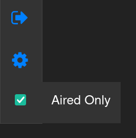

# malFilter

### Filter MyAnimeList by excluding shows that haven't been aired yet.

<br>



## How it works:

Scripts creates checkbox that allows you to filter mainly your 'plan to watch' list.
If you want to filter your 'watching', 'on hold' etc. lists by excluding Airing shows just change in line nr 8:
```js
let excludeAiring = false;
```
to 
```js
let excludeAiring = true;
```

or simply [Download](https://raw.githubusercontent.com/hyperstown/malFilter.user.js/master/malFilterA.user.js) exclude Airing version (Greasemonkey/Tampermonkey must be installed)

## Installation

- Download [Greasemonkey](https://addons.mozilla.org/en-US/firefox/addon/greasemonkey/) for Firefox

- Download [Tampermonkey](https://chrome.google.com/webstore/detail/tampermonkey/dhdgffkkebhmkfjojejmpbldmpobfkfo) for Chromium/Chrome/Brave

- [Click here](https://raw.githubusercontent.com/hyperstown/malFilter.user.js/master/malFilter.user.js) to initialize installer. 

- Installation popup should appear. Click install / OK

- Done

## Manual installation

- Download [Greasemonkey](https://addons.mozilla.org/en-US/firefox/addon/greasemonkey/) for Firefox

- Download [Tampermonkey](https://chrome.google.com/webstore/detail/tampermonkey/dhdgffkkebhmkfjojejmpbldmpobfkfo) for Chromium/Chrome/Brave

- Click add new user script

- Copy contents from `malFilter.user.js` into editor.

- Save

- Done